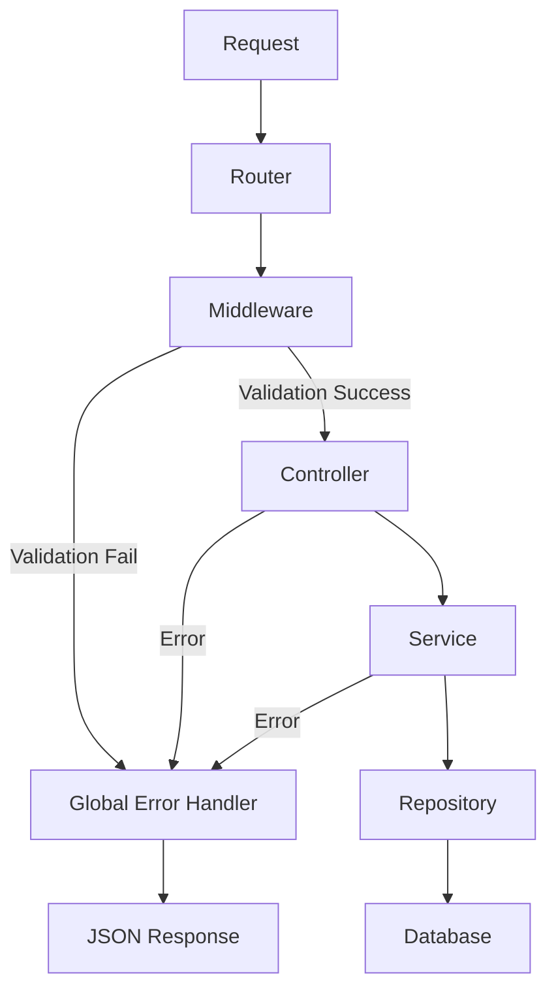

# NodeJs REST API Project

Цей проект є прикладом побудови масштабованого REST API на базі Node.js, Express та MongoDB з використанням TypeScript.

## 🛠 Налаштування проекту

### 🏁 Швидкий старт
1. Встановіть залежності:
   ```bash
   npm install
   ```
2. Налаштуйте змінні середовища в `.env` файлі (використовуйте `src/configs/config.ts` як орієнтир).
3. Запустіть сервер:
   ```bash
   npm start
   ```

### 🧹 Linter (ESLint & Prettier)
Для підтримки чистоти коду в проекті використовується ESLint та Prettier.

**Встановлення необхідних плагінів:**
```bash
npm i eslint eslint-config-prettier eslint-plugin-import eslint-plugin-prettier eslint-plugin-simple-import-sort @typescript-eslint/parser @typescript-eslint/eslint-plugin @eslint/js
```

**Або додайте в `devDependencies` вашого `package.json`:**
```json
"devDependencies": {
    "eslint": "^9.22.0",
    "eslint-config-prettier": "^10.1.1",
    "eslint-plugin-import": "^2.31.0",
    "eslint-plugin-prettier": "^5.2.3",
    "eslint-plugin-simple-import-sort": "^12.1.1",
    "@typescript-eslint/parser": "^8.26.1",
    "@typescript-eslint/eslint-plugin": "^8.26.1",
    "@eslint/js": "^9.22.0"
}
```


**Інструкції з налаштування:**
1. Створіть файлі конфігурації: [.prettierrc](.prettierrc) та [eslint.config.js](eslint.config.js).
2. Натисніть правою кнопкою миші на ці файли та оберіть **Apply**.
3. У налаштуваннях IDE встановіть **Automatic ESLint configuration**.

**Корисні команди:**
- `eslint . --ext .ts` — перевірка наявності помилок.
- `eslint . --ext .ts --fix` — автоматичне виправлення помилок у всіх файлах.

---

## 🏗 Архітектура та Взаємодія

Проект побудований за багатошаровою архітектурою, де кожен компонент має свою зону відповідальності:



1. **Router**: Визначає шлях та направляє запит до відповідного Middleware та Controller.
2. **Middleware**: Виконує попередню обробку запиту (валідація даних, перевірка ID).
3. **Controller**: Обробляє вхідні дані та викликає сервіс.
4. **Service**: Містить бізнес-логіку програми.
5. **Repository**: Взаємодіє з базою даних через моделі Mongoose.
6. **Error Handler**: Централізовано обробляє всі помилки та повертає відповідь клієнту.

---

## 🛡 Обробка помилок (ApiError)

Для стандартизованої обробки помилок використовується клас `ApiError`, який розширює стандартний клас `Error`.

- **Локація**: `src/errors/api.error.ts`
- **Використання**: Дозволяє передавати повідомлення про помилку та відповідний HTTP-статус (наприклад, 400, 401, 404).

Приклад викидання помилки:
```typescript
throw new ApiError("Користувача не знайдено", 404);
```

---

## ⚙️ Middleware (Проміжне ПЗ)

Мідлвари використовуються для відокремлення логіки перевірки від бізнес-логіки.

- **Локація**: `src/middlewares/common.middleware.ts`
- **Основні методи**:
    - `isIdValid(key)`: Перевіряє, чи є переданий ID валідним ObjectId MongoDB.
    - `validateBody(validator)`: Використовує схеми **Joi** для валідації тіла запиту.

Якщо валідація не проходить, Middleware створює екземпляр `ApiError` та передає його далі через `next(error)`, що автоматично активує глобальний обробник помилок.

---

## 🚦 Глобальний обробник помилок

Централізований обробник у файлі `src/main.ts` ловить усі помилки, що були передані через `next()` у контролерах або мідлварах, та повертає їх у форматі:

```json
{
    "status": 400,
    "message": "Деталі помилки..."
}
```