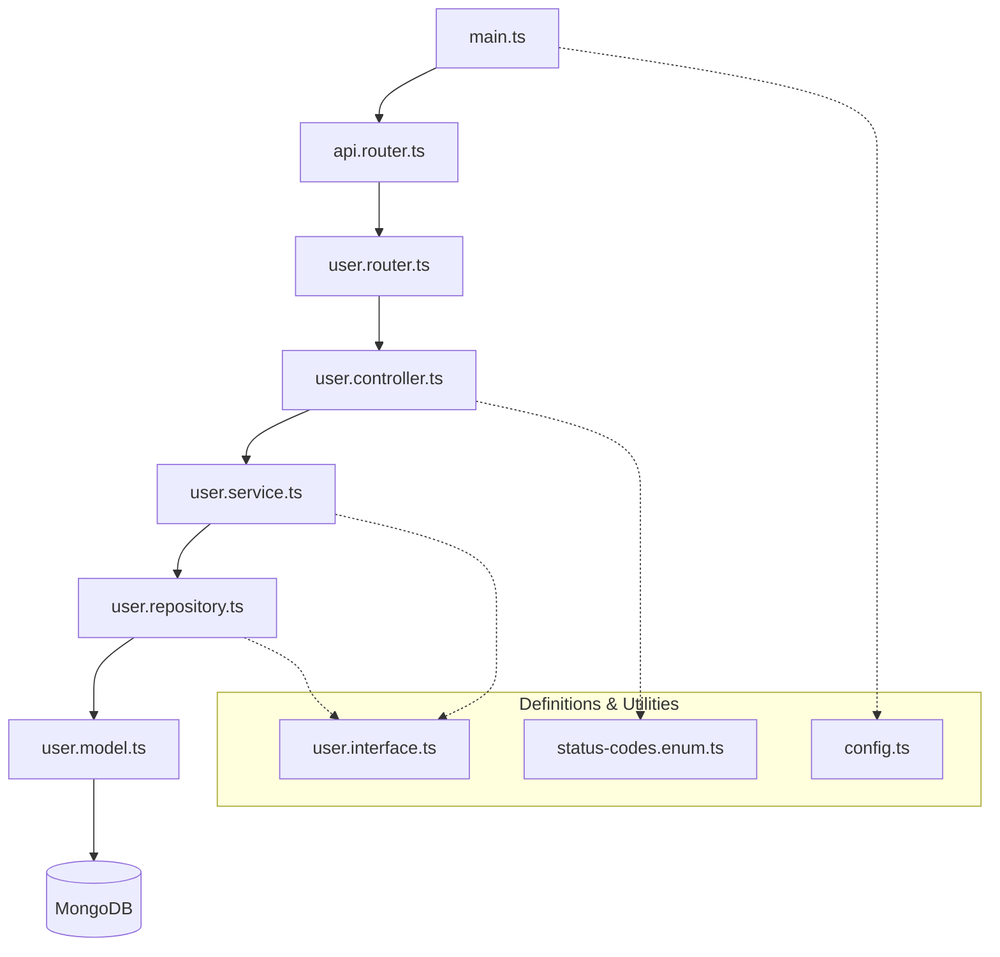

# User Management API

A simple Node.js application built with Express and MongoDB (Mongoose) to manage users. This project follows a structured architecture with clearly defined layers for better maintainability and scalability.

## Architecture & File Structure

The project is organized into several layers within the `src` directory:

### 1. **Entry Point**
*   **[main.ts](/src/main.ts)**: The heart of the application. It initializes the Express server, establishes a connection to MongoDB, and connects the main `apiRouter`.

### 2. **Configuration**
*   **[configs/config.ts](/src/configs/config.ts)**: Manages environment variables (like `PORT` and `MONGO_URI`) using `dotenv`, providing a centralized configuration object for the app.

### 3. **Routing Layer**
*   **[routers/api.router.ts](/src/routers/api.router.ts)**: The root router for the API. It mounts specific routers (e.g., handles all `/users` requests by delegating to `userRouter`).
*   **[routers/user.router.ts](/src/routers/user.router.ts)**: Defines individual endpoints for users (GET `/`, POST `/`, GET `/:id`) and maps them to controller methods.

### 4. **Controller Layer**
*   **[controllers/user.controller.ts](/src/controllers/user.controller.ts)**: Handles the "web" part of the request. It parses request parameters/body, calls the service layer, and returns the appropriate HTTP status codes and JSON data.

### 5. **Service Layer**
*   **[services/user.service.ts](/src/services/user.service.ts)**: Encapsulates the business logic. It sits between the controller and the repository, ensuring that logic remains decoupled from both HTTP handling and database-specific code.

### 6. **Data Access (Repository) Layer**
*   **[repositories/user.repository.ts](/src/repositories/user.repository.ts)**: Directly interacts with Mongoose to perform database operations (find, create, findById).

### 7. **Models & Data Definitions**
*   **[models/user.model.ts](/src/models/user.model.ts)**: Contains the Mongoose schema and model for the `user` collection.
*   **[interfaces/user.interface.ts](/src/interfaces/user.interface.ts)**: Defines TypeScript interfaces (`IUser`) and helper types (`UserDTO`) to ensure type safety across the entire codebase.
*   **[enums/status-codes.enum.ts](/src/enums/status-codes.enum.ts)**: A clean way to manage HTTP status codes instead of using magic numbers.

## How Files are Connected

The data flow follows a traditional layered architecture (top-down):



1.  **Request** arrives at `main.ts`.
2.  `main.ts` passes it to `api.router`.
3.  `api.router` routes the `/users` prefix to `user.router`.
4.  `user.router` calls a method in `user.controller`.
5.  `user.controller` calls `user.service`.
6.  `user.service` calls `user.repository`.
7.  `user.repository` uses the `User` model to query the **database**.
8.  **Response** travels back up the chain to the user.

## Setup and Installation

### 1. Install Dependencies
```bash
npm install express typescript mongoose @types/express @types/mongoose rimraf ts-node tsc-watch
```

### 2. Dependency Versions
**Dependencies:**
```json
"dependencies": {
  "express": "^5.2.1",
  "mongoose": "^9.1.5"
}
```

**Dev Dependencies:**
```json
"devDependencies": {
  "@types/express": "^5.0.6",
  "@types/mongoose": "^5.11.96",
  "rimraf": "^6.1.2",
  "ts-node": "^10.9.2",
  "tsc-watch": "^7.2.0",
  "typescript": "^5.9.3"
}
```

### 3. TypeScript Configuration
Initialize TypeScript:
```bash
tsc --init
```

Recommended `tsconfig.json` settings:
```json
{
  "compilerOptions": {
    "rootDir": "./src",
    "outDir": "./dist",
    "target": "esnext",
    "module": "commonjs",
    "moduleResolution": "node",
    "esModuleInterop": true,
    "allowSyntheticDefaultImports": true,
    "removeComments": true,
    "resolveJsonModule": true,
    "skipLibCheck": true,
    "noUnusedLocals": true
  }
}
```